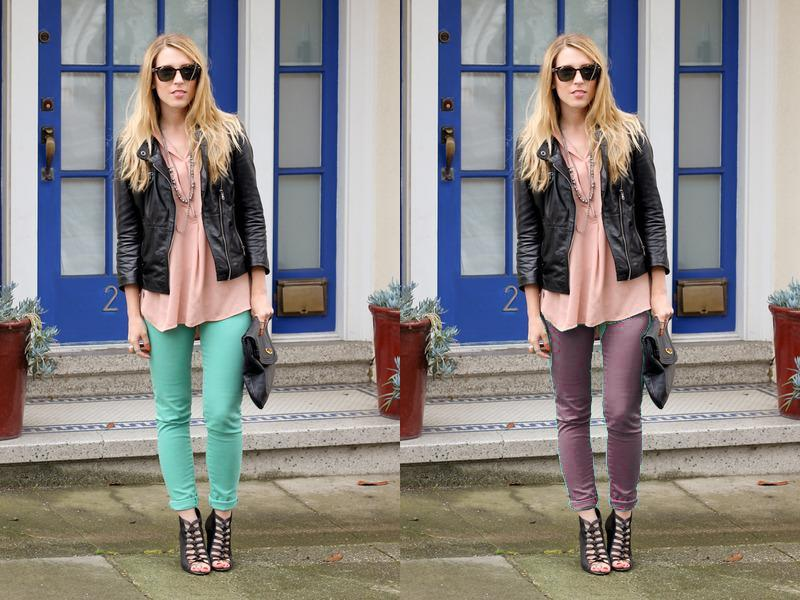

# fashion_color_coordination

色彩調和論に基づいて，ファジー推論により配色の調和度を定量的に評価する手法[1]と，  
コーディネート画像から服ごとにセグメンテーションする手法[2]を組み合わせたシステム．  

notebookで製作し，1つのファイルに詰めてある．  
不要な関数もあるが整理がかなり大変なので，とりあえずこのままアップしておく．  

セグメンテーション前提のシステムなので，実運用は難しいのではないのだろうか．  

実行には元となる画像と，それをセグメンテーションしたラベルマップのファイルが必要．  
セグメンテーション部分は別で実装してください．

## example

## reference

[1]<https://www.jstage.jst.go.jp/article/jsoft/19/1/19_1_57/_article/-char/ja>
[2]<https://esslab.jp/~ess/publications/SimoSerraACCV2014.pdf>
